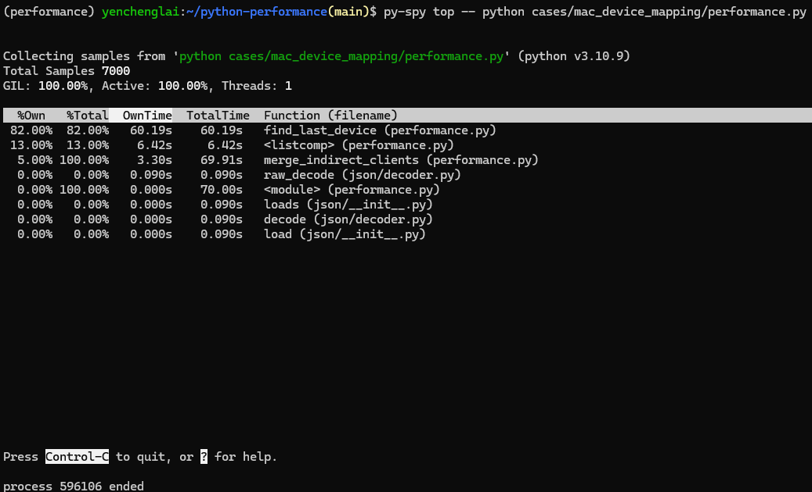

# Introduction

This is the case when I need to revise the comparation and data preparing algorithm in huge data conditions.

## How to run the code

Use the following command:

```sh
py-spy top -- python <path to the file>/performance.py
```

e.g.

```sh
py-spy top -- python cases/mac_device_mapping/performance.py
```

## Result

### Before Tuned

The below picture shows that `find_last_device` function took most of the time in the whole process.



### After Tuned
